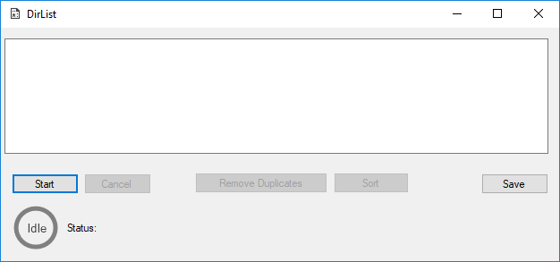
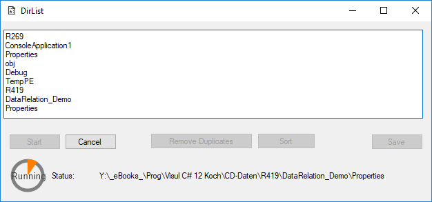

# DirList
[](https://github.com/avogelba/DirList/releases)

[](https://github.com/avogelba/DirList/blob/master/LICENSE)

Small tool I quickly wrote to get all directories of my external hard disk. Mainly a better ```DIR /S /B /AD``` output.

# Steps
 - Select Directory
 - Tool searches all subdirectories and puts them in a TextBox

 - TextBox the dublicates can then be removed
 - TextBox content can be sorted
 - TextBox content can be exported to a file

# Screens



# Compile
Use e.g. Visual Studio 2017 and update package manager
Then compile project.

If packages cant be updated install them:

    PM> Install-Package Costura.Fody

    PM> Install-Package CircularProgressBar


# Libraries Used
- To get a single executable: [Costura.Fody](https://www.nuget.org/packages/Costura.Fody/) and it's depencies
- To get a circular progress display: [CircularProgressBar](https://www.nuget.org/packages/CircularProgressBar/) and it's depencies

# License
DirList is released under the [MIT License](https://opensource.org/licenses/MIT).